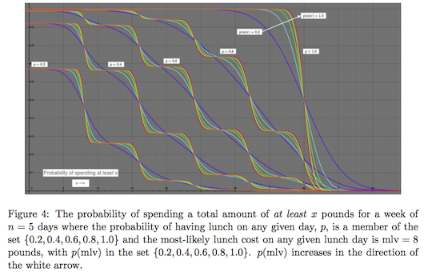

# Frank's Lunch Problem

Frank eats lunch 4 out of every 5 working days and spends a minimum of 5 pounds, a maximum of 15 pounds, with a most likely value of 8 pounds, per lunch. What is the distribution of possible lunch costs at the end of a work week?

The solution, under the (unlikely to be true but easy to manipulate mathematically) assumption that lunch costs on any given day are normally distributed, is shown below for some parameter values.

Originally written on April 6, 2015.

## Creator

That would be me, _Wagner Truppel_. If you need or want to contact me, send a message to `wagner` at `restlessbrain` dot com.

## License

I'm sharing this work under the [Creative Commons Attribution-ShareAlike 4.0 International (CC BY-SA 4.0)](http://creativecommons.org/licenses/by-sa/4.0/) license. See the LICENSE file for more information.
